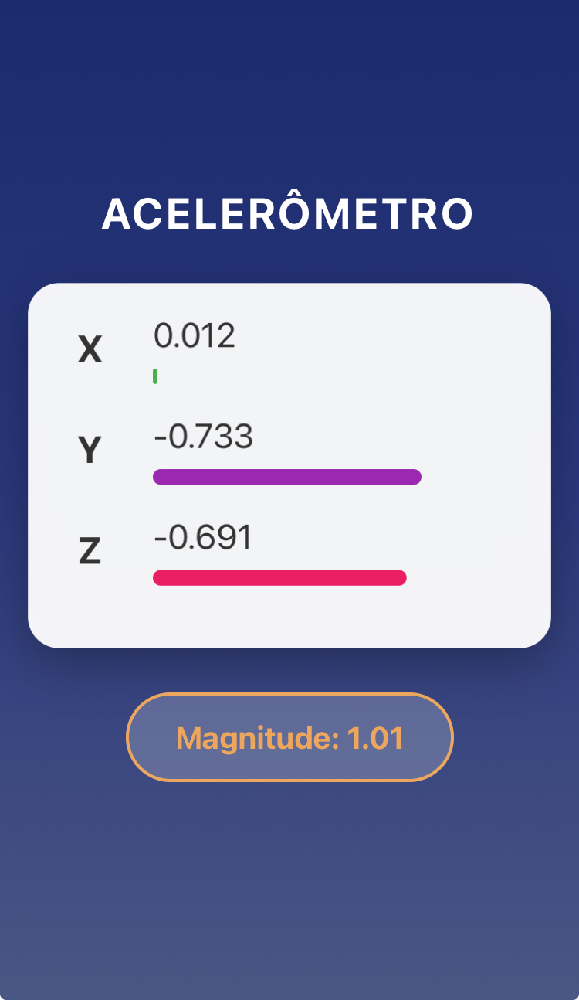

# Sensores App

Um aplicativo React Native moderno para visualização de dados do acelerômetro do dispositivo em tempo real, com interface interativa e animações responsivas.




## 📱 Funcionalidades

- Leitura em tempo real dos dados do acelerômetro (eixos X, Y e Z)
- Visualização através de barras coloridas que representam os valores
- Animações sutis baseadas no movimento detectado
- Cálculo e exibição da magnitude total do movimento
- Interface com gradientes e elementos dinâmicos

## 🚀 Tecnologias Utilizadas

- React Native
- Expo SDK
- expo-sensors (API de acelerômetro)
- expo-linear-gradient (Efeitos visuais)
- Animated API (Animações)

## ⚙️ Pré-requisitos

- Node.js (v12 ou superior)
- npm ou yarn
- Expo CLI
- Um dispositivo móvel com o aplicativo Expo Go instalado ou um emulador

## 📋 Instalação

1. Clone este repositório
   ```
   git clone https://github.com/seu-usuario/sensores-app.git
   cd sensores-app
   ```

2. Instale as dependências
   ```
   npm install
   # ou
   yarn install
   ```

3. Instale a dependência do expo-linear-gradient (caso não esteja instalada)
   ```
   expo install expo-linear-gradient
   ```

4. Inicie o projeto
   ```
   npx expo start
   ```

5. Escaneie o QR code com o aplicativo Expo Go no seu dispositivo ou execute em um emulador

## 📖 Como usar

1. Abra o aplicativo em seu dispositivo
2. Observe os valores do acelerômetro mudando em tempo real
3. Mova o dispositivo para diferentes direções para ver as mudanças nos eixos X, Y e Z
4. Observe as barras coloridas que representam os valores e a magnitude calculada

## 📝 Notas importantes

- O aplicativo precisa de permissão para acessar os sensores do dispositivo
- O desempenho pode variar dependendo do dispositivo utilizado
- As cores das barras indicam valores positivos ou negativos para melhor visualização

## 🔮 Melhorias futuras

- Adição de gráficos para histórico de movimentos
- Opção para salvar registros de movimentos
- Calibração manual do acelerômetro
- Suporte a outros sensores (giroscópio, magnetômetro)

